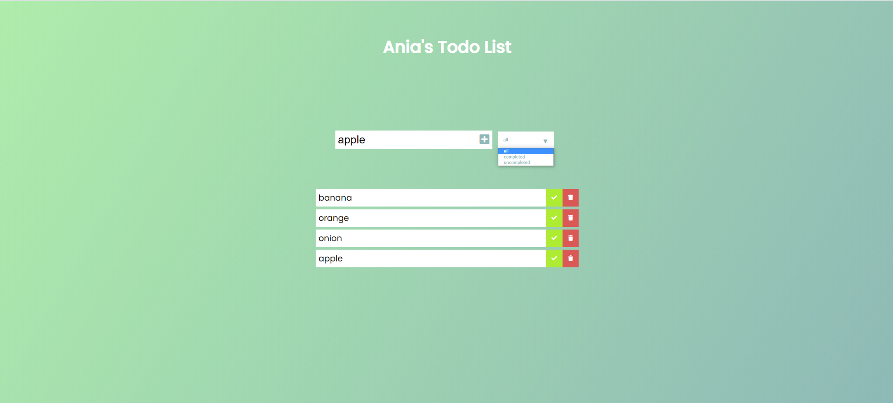

## General info

Simple project of Todolist in Vanilla JavaScript.

## Table of contents
* [General info](#general-info)
* [Screenshots](#screenshots)
* [Technologies](#technologies)
* [Status](#status)
* [Inspiration](#inspiration)

## Screenshots

<!-- 

 -->

## Technologies:
 * HTML5
 * CSS3
 * JavaScript (ES6)

## Setup
link to netlify

## Status
Project is: _completed_

## Inspiration
Project is inspired by the course "The Creative JavaScript Course" by Dev Ed.

